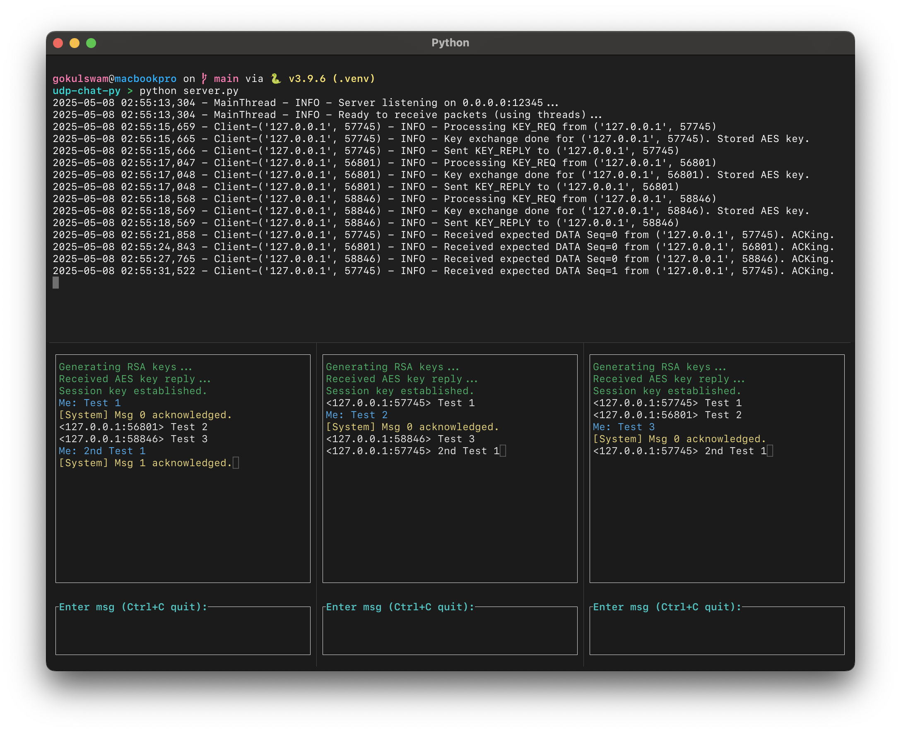

# udp-chat-py
by Gokul Swaminathan (Graduate Student)

This was for a homework assignment for COMPE 560 @ San Diego State University.

<details>
<summary><b>Screenshot Preview<b/></summary>

</details>

### [Report (PDF)](https://github.com/gokulswam/udp-chat-py/blob/main/report.pdf)

# Setup
You will need Python 3.x and the `pycryptodome` library.

1. Create a python virtual environment

   Run the following command while in the project directory:
   ```bash
   python -m venv .venv
   ```

2. Activate the environment

   On MacOS or Linux, run the following command:
   ```bash
   source .venv/bin/activate
   ```

3. Install the dependencies

   Once you enter the environment, install the dependencies:
   ```bash
   pip install -r requirements.txt
   ```

# Usage

1. Run the server

   ```bash
   python server.py
   ```

   By default, the server will be listening on `0.0.0.0` (all available network interfaces) on port `12345`.
   You will see log messages in the console indicating that the server has started and is ready to receive packets. Server logs (including errors and key events) will be printed to the standard output.

2. Run the client(s)

   **Ensure that the virtual environment is activated where you are running the client.**

   For each chat client, open a new terminal or command prompt and **activate the virtual environment** in each one.
   Navigate to the project directory.

   Run the client python file, providing the server's host address and port as command-line arguments:

    ```bash
    python client.py <server_host> <server_port>
    ```
    * Replace `<server_host>` with the IP address or hostname of the machine running the server. If running on the same machine, you can use `localhost` or `127.0.0.1`.
    * Replace `<server_port>` with the port the server is listening on (default is `12345`).

    **Example:**
    ```bash
    python client.py localhost 12345
    ```

   Logs for the client are saved to `client.log` in the same directory.

   To quit the client, press **Ctrl+C**.

# Important Details

## Assumptions and Limitations

* A basic reliability layer (sequence numbers, acknowledgements, timeouts, and limited retransmissions) has been implemented for chat messages sent *from* the client to the server. The server acknowledges these messages.

* The initial key exchange (KEY_REQ from client, KEY_REP from server containing AES key) is handled with a single request from the client. If the server's KEY_REP is lost, the client does not automatically retry the KEY_REQ. It waits for the key, and messaging is blocked until the key is received.

* Chat messages broadcast from the server to other clients are sent via best-effort UDP. There is no ACK mechanism from clients back to the server for these broadcast messages, so delivery is not guaranteed.

* The reliability for client-to-server chat is basic (similar to stop-and-wait). It does not include advanced features like sliding windows, congestion control, or dynamic RTT estimation. Out-of-order DATA packets received by the server are ignored.

* The server stores the AES key, public RSA key, and expected sequence number for each client in memory. If the server restarts, the data is lost.

## Cryptographic Design

This project uses a hybrid encryption design with `pycryptodome`:

1. Key Exchange (RSA)
   - Clients generate 2048-bit RSA key pairs. Public keys are sent to the server.
   - The server generates a 128-bit AES key per client. The key is encrypted with the client's RSA public key and sent back.

2. Message Encryption (AES)
   - All chat messages are encrypted using AES-128 in CBC mode with the shared session key.
   - A random 16-byte initialization vector (IV) is generated for each message and prepended to the ciphertext.
   - Padding ensures that the plaintext is a multiple of the AES block size.

3. Integrity and Authenticity (HMAC)
   - HMAC-SHA256 is applied ot the *IV + Ciphertext* using the AES key.
   - The HMAC tag is prepended.
   - HMAC is verified before decryption.

4. Safe Transmission (Base64 Encoding)
   - The final payload and key exchange data are encoded for safe transmission.

## Requirements

### Server
* Accept public RSA keys from multiple clients.
* Generate a random AES key per client.
* Encrypt each AES key using the corresponding client’s RSA public key.
* Send the encrypted AES key back to the client.
* Receive encrypted chat messages from clients.
* Decrypt and broadcast each message (after re-encryption) to all other connected
clients.

### Client
* Generate an RSA key pair (public/private) at startup.
* Send the public key to the server.
* Receive and decrypt the AES symmetric key using the private key.
* Use the AES key to encrypt outgoing messages and decrypt incoming ones.
* Display chat messages in real time.

### Encryption Features
* Use RSA (2048-bit or higher) for key exchange.
* Use AES (128-bit or higher) for symmetric encryption.
* Base64-encode encrypted messages for safe transmission over UDP.
* Ensure proper padding and IV handling (e.g., CBC or GCM mode). ( You will need to
generate a fresh random Initial Vector for each encryption and use padding if needed to
ensure that the plaintext is a multiple of block size)

## Special Requirements for Graduate Students
* Implement message authentication using HMAC.
* Build a terminal-based UI with curses or a simple GUI
* Add logging or error handling for packet loss and retransmissions (simulating reliable
UDP).
